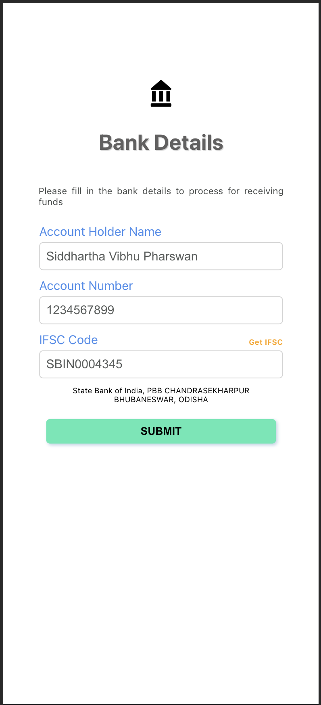
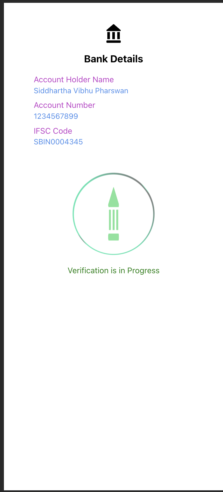
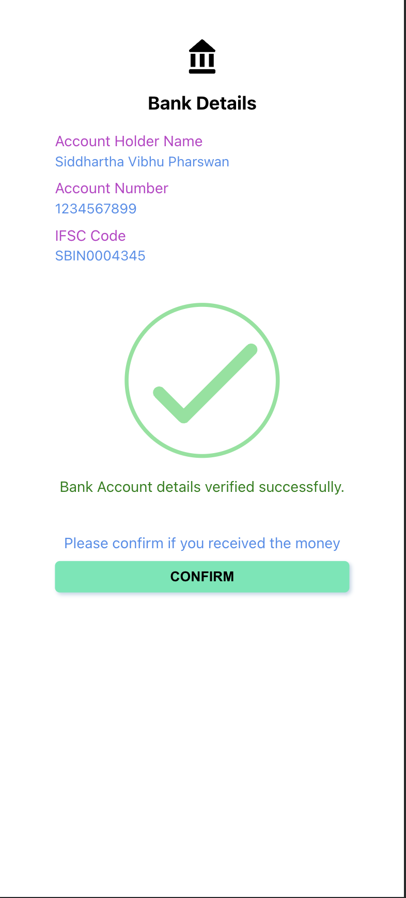

# Bank Details Page

# Setup

1. Run `cd bank-verification && npm i && npm start`.
2. To build run `npm run build`
3. Using Plain CSS not using any library in order to avoid overload as it is getting loaded in Mobile app.

# App Look

    
    
    

